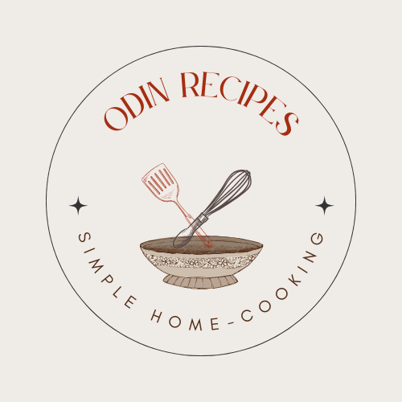

# odin-recipes

## About
A simple website of recipes in HTML (with a smidge of CSS). Sadly still very ugly and static. Was positively itching to add some CSS, but I succeeded in withholding myself. This site is very much a work in progress. Imagine its power when I discover JS.

### What I Learned:
- Resize cursor image to 32x32 or 50x50 px (compression leads to loss in image quality though) using [this website](https://www.iloveimg.com/resize-image/resize-png)
- Add transparent background to logo using [Adobe](https://www.adobe.com/express/feature/image/remove-background/png/transparent)
- Learned about ideal size for website logos and favicons
- Made a custom site logo using Canva (the most exciting part by far), though it's practically invisible as a favicon for all its worth
- Changed the cursor to a whisk. Doubtful whether it is easily recognizable when its resolution is so low
- Generate favicons using [favicon.io](https://favicon.io/favicon-converter/)
- [Unsplash](https://unsplash.com/) for high-quality images  

  

The odin-recipes site logo

### Issues: 
- The cursor is still pretty low-res
- The favicon is blurry, need to design it better next time

### In future:
- More styling with CSS
- A proper home page

